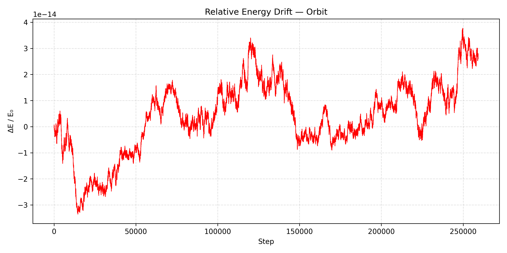
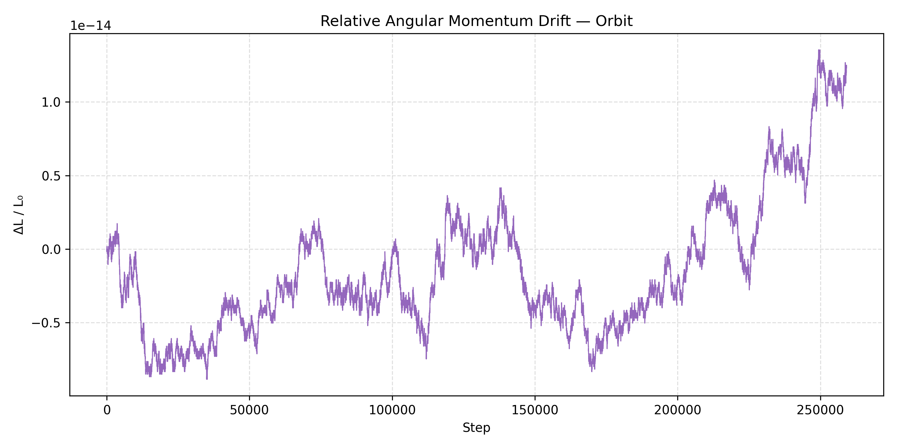

# Summary

The Orbital Mechanics Engine is a high-performance C++ library for simulating gravitational N-body systems, exposed to the scientific Python ecosystem via pybind11 bindings and a standalone command-line interface. It implements four numerical integrators — classical fourth-order Runge-Kutta (RK4), symplectic Leapfrog, fourth-order symplectic Yoshida, and adaptive Dormand-Prince RK45 — alongside a Schwarzschild first post-Newtonian (1PN) general relativistic correction. Initial conditions can be sourced directly from the NASA JPL Horizons service or from DE440 ephemerides validated against SPICE kernels. Conservation quantities (total energy, angular momentum, linear momentum) are tracked at every output step, and solar eclipse geometry (umbra and penumbra) is computed as a post-processing pass over the stored trajectory.

# Statement of Need

Existing community tools such as REBOUND [@rein2012rebound] provide mature, battle-tested N-body engines but introduce non-trivial dependencies and abstract away the underlying integration details. For researchers and students who need a transparent, self-contained implementation — one where every integration step, error estimate, and relativistic correction is readable C++ — no lightweight alternative exists that simultaneously offers Python ergonomics, a first-principles GR perturbation, and direct Horizons connectivity.

The Orbital Mechanics Engine fills this gap. It is self-contained (no external solver or SPICE library required at runtime), ships a typed Python API alongside its CLI, and makes all physics explicitly visible in the source. The post-Newtonian correction and adaptive step-size control make it suitable not only for demonstration purposes but for quantitative studies of relativistic precession and long-baseline conservation behaviour.

# Functionality

## Numerical Integrators

Four integration methods are provided, selectable at runtime via both the CLI (`--integrator`) and Python (`integrator=` keyword):

- **RK4** — Classical fourth-order Runge-Kutta. Four force evaluations per step; $O(\Delta t^5)$ local truncation error. Suitable for short integrations where energy drift is acceptable.
- **Leapfrog (Störmer-Verlet)** — Second-order symplectic integrator. One force evaluation per step; time-reversible and symplectic, so energy oscillates rather than drifts over long integrations.
- **Yoshida4** — Fourth-order symplectic integrator via triple composition of Leapfrog substeps [@yoshida1990]. Three force evaluations per step; substantially tighter energy bounds than Leapfrog at the same timestep while preserving the symplectic property.
- **RK45 (Dormand-Prince)** — Adaptive fifth-order integrator with embedded fourth-order error estimate [@dormand1980]. Step size is controlled by a scaled RMS error norm; the First Same As Last (FSAL) property reduces effective cost to five force evaluations per accepted step. The timestep bounds $\Delta t_\text{min}$ and $\Delta t_\text{max}$ are user-configurable.

## Post-Newtonian GR Correction

An optional Schwarzschild first post-Newtonian acceleration perturbation is applied after the Newtonian pairwise force accumulation:

$$\Delta\mathbf{a}_i = \frac{GM}{c^2 r^3}\left[\left(\frac{4GM}{r} - v^2\right)\mathbf{r} + 4(\mathbf{r}\cdot\mathbf{v})\,\mathbf{v}\right]$$

where $\mathbf{r}$ and $\mathbf{v}$ are measured relative to the most massive body (the central attractor). The correction is off by default and enabled with `--gr` (CLI) or `gr=True` (Python), making it straightforward to isolate the relativistic contribution by comparing runs with and without the flag. This perturbation reproduces the 43 arcseconds per century perihelion precession of Mercury when applied to a solar system simulation with accurate initial conditions.

## Initial Conditions and Validation

The `orbit-sim fetch` and `orbit-sim build-system` commands query the NASA JPL Horizons REST API [@horizons] to retrieve state vectors at a user-specified epoch for any solar system body. The retrieved initial conditions were cross-validated against DE440 ephemeris kernels loaded via the SPICE toolkit [@naif], confirming positional agreement at the sub-kilometre level.

## Conservation Monitoring

At every recorded output step the engine computes total mechanical energy, angular momentum magnitude and components, and linear momentum magnitude. Relative drifts $\delta E / E_0$, $\delta L / L_0$, and $\delta P / P_0$ are exported to a companion CSV alongside the trajectory, enabling straightforward long-term stability analysis without post-processing.

## Eclipse Detection

When a Sun–Earth–Moon system is detected among the loaded bodies, the engine computes solar eclipse geometry at each recorded step: shadow axis direction, umbra radius, penumbra radius, and eclipse type (total, annular, or partial). Results are written to a separate CSV that can be overlaid on the trajectory data.

## Interfaces

- **C++ library** — `runSimulationCore` and `runSimulationAdaptiveCore` return a `SimulationResult` struct for programmatic embedding.
- **Python** — `orbit.simulate()` and `orbit.simulate_adaptive()` expose the same interface with NumPy array accessors (`positions_numpy()`, `energies_numpy()`).
- **CLI** — `orbit-sim run` for fixed-step simulations; all parameters (integrator, timestep, stride, GR flag) are exposed as flags.
- **Output** — trajectory positions and per-step conservation quantities written to CSV for downstream analysis or visualisation.

# Performance

Energy conservation benchmarks on a 30-day Earth–Moon simulation (fixed timestep $\Delta t = 60\,\text{s}$) show the expected hierarchy across integrators. Yoshida4 achieves roughly two orders of magnitude lower maximum relative energy drift than Leapfrog at the same timestep, consistent with the theoretical $O(\Delta t^5)$ vs $O(\Delta t^3)$ scaling. Adaptive RK45 with $\Delta t_\text{max} = 3600\,\text{s}$ achieves comparable drift to RK4 at $\Delta t = 60\,\text{s}$ while taking roughly half as many force evaluations. Comparisons against REBOUND using identical initial conditions and the IAS15 integrator [@rein2015ias15] confirm that energy drift magnitudes are within the same order across the full one-year solar system integration.

# Acknowledgements

Initial conditions were obtained from the NASA JPL Horizons system. SPICE validation used kernels provided by the NASA Navigation and Ancillary Information Facility (NAIF).

# References
